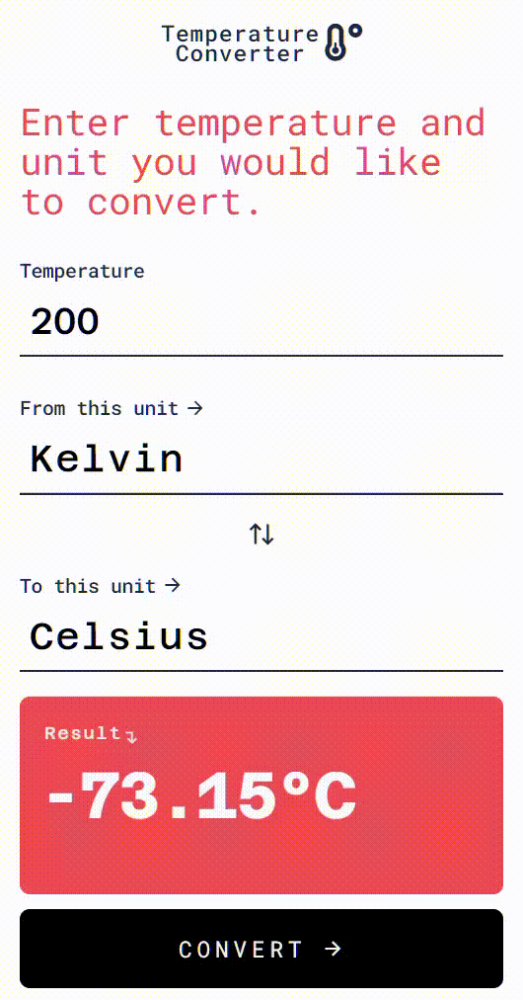

# 🌡️ [ Temperature Converter Web App ](https://deepsoumya617.github.io/Temperature-Converter/)

Convert temperatures between Celsius, Fahrenheit, and Kelvin effortlessly!

 <!-- Replace with an actual screenshot or GIF -->

---


## 🚀 Key Features

✅ Convert temperature between **Celsius, Fahrenheit, and Kelvin.**  
✅ **Real-time conversion** as you type.  
✅ **Interactive UI** with Tailwind CSS.   
✅ **Responsive**.  

---

## 👨‍💻 WIP
❌ **Progressive Web App (PWA)** support for offline use. 

## 🛠 Tech Stack

- HTML, JavaScript  
- Tailwind CSS (**CLI**)

---

## 📂 Project Structure

```plaintext
tempConverter/
│── docs/               # html, css, js files for deployment.
│── node_modules/       # Dependencies (auto-generated)
│── src/                # Source code
│   ├── index.html      # Main HTML file
│   ├── app.js         # JavaScript logic
│   ├── input.css      # Tailwind CSS input styles
│   ├── output.css     # Tailwind CSS output styles
│── .gitignore         # Ignored node_modules/
│── .prettierrc        # Prettier config file
│── package.json       
│── README.md          # You are here! 📌
```

---

## 🔧 Installation & Modification

```bash
# Clone the repository locally
git clone https://github.com/deepsoumya617/Temperature-Converter.git  

# Navigate into the project directory && src/
cd tempConverter 

# Install dependencies  
npm install  

# For editing navigate into src/
cd src/

# Start the Tailwind CLI
npm start

## Edit the index.html file and open with LocalHost
 
```

---


## 🤝 Contributing

Contributions are welcome! I want to add the **PWA** or **Progressive Web App** support for this web app. Help me to:

🪛 Create and understand **Manifest.json** file.   
🪛 Create and understand **Service-Worker.js** file.

### 🧪 Follow the steps for contribution
1. **Fork** the repository  
2. **Create** a new branch (`git checkout -b feature-name`)  
3. **Commit** your changes (`git commit -m "Added feature"`)  
4. **Push** to your branch (`git push origin feature-name`)  
5. **Open a Pull Request**  

---

## 📜 License

This project is **open-source** under the [MIT License](LICENSE).  

---

> Made with ❤️ by [Soumyadeep Ghosh](https://github.com/deepsoumya617)

